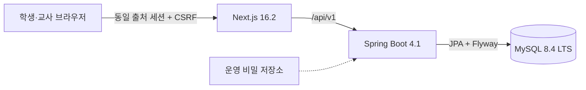

# 학교 소통 제안 시스템

경북소프트웨어마이스터고 학생과 교사가 건의·제안·정보 요청을 투명하게 주고받기 위한 학생자치 기반 시스템이다. 정식 서비스명과 자체 브랜딩은 아직 정해지지 않아 현재는 설명형 이름과 중립 색상만 사용한다. 학교 공식 로고·교표·색상은 사용하지 않는다.

> 현재 상태: 프로젝트 기반, 자체 인증·권한 생명주기, 공개 제안·동의·정식 안건, 담당 교사 공식 답변, 신고와 3인 고정 심의, 학생부장교사 일회 신원 확인까지 구현되었다. 비공개 고충과 재정·행정 공개는 아직 구현하지 않았으며 운영 배포는 수행하지 않았다.

## 1. 해결하려는 문제와 제품 원칙

학생 제안은 공개적으로 동의를 모으고, 활성 학생 50명 이상이 동의하면 학교가 검토해야 하는 정식 안건으로 승격된다. 익명 표현을 허용하지만 운영자가 임의로 신원을 열람하거나 글을 영구 삭제할 수 없도록 공개 제한과 신원 확인을 서로 다른 3인 심의로 다룬다.

- 욕설이나 비판적 표현을 작성 전에 자동 차단하지 않는다.
- 학교폭력·자해 위험·개인정보·성희롱·차별 등은 공개 투표가 아닌 비공개 고충 경로로 분리한다.
- 보안 정책은 UI가 아니라 백엔드 서비스와 데이터베이스에서 강제한다.
- 실제 운영 데이터, 익명 연결정보, 비밀, 운영 로그와 백업은 공개 저장소에 넣지 않는다.

## 2. 사용자와 권한 요약

- `STUDENT`: 공개 제안 작성·조회·동의와 비공개 고충 제출
- `TEACHER`: 50명 이상 정식 안건의 검토와 공식 답변. 50명 미만 제안은 기본적으로 조회 불가
- `SUPER_ADMIN`: 계정, 역할, 임기 기반 보직, 운영 설정 관리. 익명 신원 열람 권한은 없음
- `STUDENT_AFFAIRS_TEACHER`, `STUDENT_COUNCIL_PRESIDENT`, `STUDENT_COUNCIL_VICE_PRESIDENT`: 임기 이력이 있는 보직. 사건 생성 시점의 세 사람을 심의자로 고정

상세 허용 범위는 [권한 매트릭스](docs/permission-matrix.md)를 본다.

## 3. 50명 동의와 정식 안건

```text
제안 생성 + 작성자 자동 1표
→ 학생 동의 모집
→ 유효 동의 50명
→ 한 트랜잭션에서 정식 안건 승격·이력·알림
→ 교사 검토와 공식 답변
→ 실행 상태 추적
```

한 학생의 중복 동의는 MySQL 고유 제약으로 최종 차단한다. 승격 이후 동의 철회로 일반 제안으로 되돌아가지 않는다.

## 4. 삭제와 신원 확인

신고, 공개 제한, 신원 확인, 실제 신원 열람은 별개의 행위다. 공개 제한은 원문을 지우는 물리 삭제가 아니라 일반 사용자에게 숨기는 소프트 삭제다. 신원 확인은 세 심의자의 전원 승인 뒤에도 배정된 학생부장교사만 최근 재인증과 사유 확인을 거쳐 수행하며, 학생회장·부회장과 슈퍼 어드민은 실제 신원을 볼 수 없다.

## 5. 시스템 구조



자세한 경계는 [아키텍처](docs/architecture.md), [ERD](docs/erd.md), [위협 모델](docs/security-model.md)을 본다.

## 6. 디렉터리

```text
backend/       Spring Boot API, Flyway, 백엔드 테스트
frontend/      Next.js App Router, OpenAPI 생성 타입
docs/          아키텍처·ERD·권한·상태·UX·결정 문서
.github/       CI, Issue/PR 템플릿, CODEOWNERS 준비
docker-compose.yml
```

## 7. 고정 기술 버전

| 구성 | 버전 | 선택 근거 |
| --- | --- | --- |
| Java | 25.0.4 LTS | 최신 LTS 보안 업데이트. Boot 4.1 지원 범위(17~26) |
| Spring Boot | 4.1.0 | [공식 최신 안정판](https://docs.spring.io/spring-boot/index.html) |
| Gradle | 9.4.0 | Boot 4.1이 지원하는 9.x, wrapper 고정 |
| springdoc-openapi | 3.0.3 | Spring Boot 4 계열 호환 안정판 |
| Bouncy Castle | 1.85 | Argon2id 구현에 필요한 최신 안정판 |
| Testcontainers | 2.0.5 | 실제 MySQL 마이그레이션 검증 |
| Node.js | 24.18.0 LTS | [공식 최신 LTS](https://nodejs.org/en/about/previous-releases) |
| Next.js | 16.2.11 Active LTS | [2026년 7월 보안 릴리스](https://nextjs.org/blog) |
| React | 19.2.8 | Next.js 16 호환 안정판 |
| TypeScript | 5.9.3 | `openapi-typescript` 7.x의 `^5.x` peer 범위와 호환 |
| A stryx | 0.2.0 | 중립 테마, 접근성 기본값, 반응형 앱 셸과 공통 컴포넌트 |
| Playwright | 1.62.1 | 브라우저 기반 핵심 역할·권한·반응형 흐름 검증 |
| MySQL | 8.4.10 LTS | [기능 변화가 제한된 LTS 보안 패치](https://dev.mysql.com/doc/relnotes/mysql/8.4/en/news-8-4-10.html) |

`package-lock.json`, Gradle wrapper와 dependency lock으로 재현 가능한 해석 결과를 유지한다. 프런트는 알려진 transitive 취약점을 피하기 위해 호환되는 `postcss`와 `sharp` 보안 버전을 overrides로 고정한다.

## 8. 사전 설치

- JDK 25.0.4 계열
- Node.js 24.18.0과 npm 10.9 이상
- Docker Desktop 또는 Docker Engine + Compose v2

macOS Homebrew OpenJDK가 `/usr/libexec/java_home`에 보이지 않으면 다음처럼 현재 셸에만 경로를 지정한다.

```bash
export JAVA_HOME=/opt/homebrew/opt/openjdk/libexec/openjdk.jdk/Contents/Home
```

## 9. 환경변수

루트 예제를 복사하고 로컬 전용 비밀번호를 바꾼다. `.env`는 Git에서 제외된다.

```bash
cp .env.example .env
```

| 변수 | 용도 |
| --- | --- |
| `MYSQL_DATABASE`, `MYSQL_USER`, `MYSQL_PASSWORD`, `MYSQL_ROOT_PASSWORD`, `MYSQL_PORT` | 로컬 MySQL 컨테이너 |
| `DB_URL`, `DB_USERNAME`, `DB_PASSWORD` | Spring 데이터소스 |
| `DB_POOL_MAX_SIZE`, `DB_POOL_MIN_IDLE` | DB 연결 풀 |
| `BACKEND_PORT`, `BACKEND_INTERNAL_URL` | 백엔드 포트와 Next 프록시 목적지 |
| `SESSION_TIMEOUT`, `SESSION_COOKIE_SECURE` | 세션 만료와 Secure 쿠키 |
| `OPENAPI_ENABLED`, `SWAGGER_UI_ENABLED` | 개발 문서. 운영 프로필은 항상 비활성 |
| `LOGIN_FAILURES_BEFORE_DELAY`, `LOGIN_MAXIMUM_DELAY_SECONDS` | 영속 로그인 방어 설정 |
| `GENERAL_REQUESTS_PER_MINUTE` | 단일 인스턴스 일반 API 제한 설정 |
| `ACTIVATION_CODE_TTL`, `PASSWORD_RESET_CODE_TTL`, `REAUTHENTICATION_TTL` | 개인별 일회 코드 만료와 민감 작업 재인증 유효 시간 |
| `MINIMUM_PASSWORD_LENGTH`, `MAXIMUM_PASSWORD_LENGTH` | 비밀번호 길이 정책 |
| `THROTTLE_FINGERPRINT_SECRET` | 계정/IP 차단 식별자를 HMAC 처리하는 32자 이상 운영 비밀 |

운영 비밀은 `.env`나 Git에 저장하지 않는다.

## 10. MySQL과 Docker Compose

```bash
docker compose config
docker compose up -d mysql
docker compose ps
```

MySQL은 `127.0.0.1`에만 게시된다. 데이터는 `mysql-data` named volume에 보존된다.

## 11. 데이터베이스 마이그레이션

백엔드 시작 시 Flyway가 적용되지 않은 마이그레이션을 순서대로 실행한다. Hibernate는 스키마를 생성하지 않고 `validate`만 수행한다. 적용된 마이그레이션 파일은 수정하지 않고 새 버전을 추가한다.

첫 마이그레이션은 사용자·자격 증명·역할·보직·일회 코드·영속 차단 상태·감사 로그·Spring Session 테이블을 만든다.

## 12. 백엔드 실행

```bash
cd backend
set -a
source ../.env
set +a
./gradlew bootRun
```

상태 확인:

```bash
curl -i http://localhost:8080/api/v1/system/status
curl -i http://localhost:8080/actuator/health
```

## 13. 프런트엔드 실행

```bash
cd frontend
npm ci
npm run dev
```

브라우저에서 `http://localhost:3000`을 연다. `/activate`, `/login`, `/password-reset` 화면은 실제 API, CSRF 토큰과 MySQL 세션을 사용한다. `/proposals`에서 제안·동의·공식 답변을 확인하고, 고정 심의자는 `/moderation`에서 신고 사건과 의결을 처리한다.

프런트 UI는 `@astryxdesign/core`와 `@astryxdesign/theme-neutral`을 기준으로 구성한다. 컴포넌트 선택, 토큰, 접근성, 앱 셸 규칙은 [프런트 에이전트 가이드](frontend/AGENTS.md), 실제 시각 언어는 [디자인 시스템](DESIGN.md)을 따른다.

## 14. 최초 슈퍼 어드민과 시드 데이터

공통 초기 비밀번호, 하드코딩 계정, 운영 마이그레이션 속 시드 사용자는 만들지 않는다. 빈 DB에서 최초 한 번 다음 명령으로 활성화 대기 슈퍼 어드민을 생성한다.

```bash
cd backend
mkdir -p ../.bootstrap
set -a
source ../.env
set +a
export BOOTSTRAP_LOGIN_ID=initial.admin
export BOOTSTRAP_DISPLAY_NAME='최초 관리자'
export BOOTSTRAP_OUTPUT_FILE="$PWD/../.bootstrap/initial-admin.txt"
./gradlew bootstrapSuperAdmin
```

명령은 `BOOTSTRAP_OUTPUT_FILE`이 이미 존재하면 중단하며 POSIX 권한 `0600`으로 새 파일을 만든다. 가입 코드 원문은 환경변수·DB·로그에 넣지 않고 이 파일에만 한 번 기록한다. DB의 단일 부트스트랩 마커 때문에 다른 출력 경로로 다시 실행해도 두 번째 최초 관리자는 생성되지 않는다. `/activate`에서 코드를 사용한 뒤 해당 파일을 안전하게 폐기한다.

로그인 직후 또는 `/api/v1/auth/reauthenticate`로 최근 재인증한 슈퍼 어드민은 다음 API를 사용할 수 있다.

- `POST /api/v1/admin/users`: 활성화 대기 계정·역할 생성과 가입 코드 1회 반환
- `POST /api/v1/admin/users/{publicId}/activation-code`: 이전 가입 코드 폐기 후 재발급
- `POST /api/v1/admin/users/{publicId}/password-reset-code`: 이전 재설정 코드 폐기 후 발급
- `POST /api/v1/admin/users/{publicId}/suspensions`, `reactivations`: 계정 정지·재활성화
- `POST /api/v1/admin/users/{publicId}/roles`: 기간 기반 역할 추가
- `POST /api/v1/admin/offices/{office}/appointments`: 보직 임명·후임 예약
- `GET /api/v1/admin/users/{publicId}`: 계정 상태와 역할·보직 이력

코드 응답은 `Cache-Control: no-store`이며 원문은 DB와 감사 로그에 저장하지 않는다. 운영 계정을 수동 SQL로 만들지 않는다.

## 15. Swagger와 OpenAPI

백엔드가 개발 설정으로 실행 중일 때:

- Swagger UI: `http://localhost:8080/swagger-ui.html`
- OpenAPI JSON: `http://localhost:8080/v3/api-docs`

`application-prod.yml`은 두 엔드포인트를 비활성화한다. Swagger도 실제 세션과 CSRF 규칙을 우회하지 않는다.

## 16. OpenAPI TypeScript 타입 생성

백엔드를 실행한 뒤:

```bash
cd frontend
npm run generate:api
npm run typecheck
```

생성 대상은 `frontend/lib/api-schema.d.ts`다. 이 파일에 DTO를 손으로 중복 정의하지 않는다.

## 17. 테스트와 검증

백엔드 단위 테스트와 실제 MySQL 마이그레이션 통합 테스트:

```bash
cd backend
./gradlew test
```

프런트 정적 검증과 프로덕션 빌드:

```bash
cd frontend
npm run check
npm audit
```

실제 MySQL, Spring Boot, Next.js와 Chromium을 격리된 임의 포트에서 함께 실행하는 전체 E2E 검증:

```bash
cd frontend
npx playwright install chromium
npm run e2e
```

E2E는 빈 MySQL에 Flyway 마이그레이션을 적용하고 학생 50명, 교사, 관리자, 고정 심의자를 실제 API로 준비한 뒤 공개 제안, 정식 안건, 공식 답변, 관리자 지정, 3인 심의, 학생부장교사 일회 신원 확인을 검증한다. 종료 시 컨테이너와 프로세스를 정리하며 실패 진단 파일은 `frontend/test-results`와 임시 진단 디렉터리에 남긴다. GitHub Actions도 같은 `npm run e2e`를 실행한다. 인메모리 DB만으로 DB 불변조건을 검증하지 않는다.

## 18. 주요 설정

타입 안전한 초기 보안 설정은 `app.security` 아래에 둔다. 정확한 운영 임계값은 환경변수로 조정하며 코드 여러 곳에 상수를 복제하지 않는다. 제안 답변 기한과 동의 만료 기간은 학교 결정 전까지 구현하지 않는다.

## 19. 보안과 비밀 관리

- 운영은 HTTPS와 Secure/HttpOnly/SameSite 세션 쿠키를 요구한다.
- CSRF 토큰, CSP, 보안 헤더, traceId 공통 오류 기반이 포함되어 있다. 로그인 성공 시 세션을 새로 만들고 비밀번호 재설정 시 해당 사용자의 기존 세션을 모두 폐기한다.
- 로그인·활성화·재설정 실패는 계정과 IP 각각 HMAC 지문으로 MySQL에 누적하며 지수 지연을 적용한다.
- 전달 IP는 Tomcat의 신뢰 프록시 규칙을 사용하는 `native` 전략으로 해석한다. 운영 프록시 범위는 배포 시 명시적으로 제한한다.
- 감사 로그에 비밀번호, 코드 원문, 세션 ID, 암호화 키, 익명 평문 신원을 기록하지 않는다.
- 익명 연결정보 암호화 키는 DB와 Git 밖의 운영 비밀 저장소에서 공급한다.
- 취약점은 공개 Issue로 신고하지 않고 GitHub Private Vulnerability Reporting 또는 확정된 비공개 채널을 사용한다.

실제 운영 서버를 허가 없이 시험하지 않는다. 상세 범위와 조정 공개 절차는 [SECURITY.md](SECURITY.md)를 따른다. 현재 비공개 연락처와 저장소 관리 주체는 아직 결정되지 않았다.

## 20. 백업과 복구

운영 DB/백업 정책은 미정이며 로컬 Compose는 백업 체계가 아니다. 운영 전 암호화 백업, 접근 통제, 복원 훈련, 키와 백업의 분리, 보존 기간, 마이그레이션 실패 복구 절차를 승인해야 한다. 운영 백업은 공개 저장소에 절대 넣지 않는다.

## 21. 자주 발생하는 문제

- `Cannot find a Java installation ... 25`: 위 macOS `JAVA_HOME` 예시를 적용한다.
- `DB_PASSWORD` 누락: `.env.example`을 복사한 뒤 백엔드 실행 셸에서 export한다.
- MySQL 포트 충돌: `.env`의 `MYSQL_PORT`와 `DB_URL` 포트를 함께 변경한다.
- OpenAPI 타입 생성 연결 실패: 백엔드와 MySQL health를 먼저 확인한다.
- Node engine 경고: `.nvmrc`의 Node 24.18.0을 사용한다.

## 22. 개발 및 기여 규칙

[CONTRIBUTING.md](CONTRIBUTING.md)와 [API 규약](docs/api-conventions.md)을 따른다. Entity를 API로 반환하지 않고 Request/Response DTO를 분리하며, 모든 쓰기는 명시적인 트랜잭션과 서비스 권한 검사를 가진다.

## 23. 라이선스와 고지

애플리케이션 코드는 Apache-2.0을 기본으로 한다. 학교명, 교표, 로고와 기타 상표 자산은 코드 라이선스에 포함되지 않는다. 최종 저작권 주체가 정해지기 전에는 임의 저작권자를 표기하지 않는다. 자세한 대기 결정은 [open-questions](docs/decisions/open-questions.md)에 있다.

## 24. 브랜치와 릴리스

MVP 전에는 장기 브랜치 `main`만 두고 짧은 feature branch를 PR로 squash merge한다. `develop`, `release/*`, `hotfix/*`는 만들지 않는다. v1.0 수준의 안정 릴리스와 복수 유지관리/병행 유지보수 필요가 생긴 뒤에만 경량 GitFlow로 전환한다. 상세 규칙은 [branching-and-releases](docs/branching-and-releases.md)에 있다.

## 25. 보안 취약점 신고

공개 Issue, 공개 PR, 공개 브랜치에 미공개 취약점 재현을 올리지 않는다. 특히 익명 신원 노출은 최소한으로만 재현하고 실제 데이터에 접근하지 말고 즉시 비공개 신고한다. [SECURITY.md](SECURITY.md)의 정책을 따르며, 보안 연락 채널과 GitHub Organization은 최초 공개 전에 확정해야 한다.

## 26. 알려진 제한과 다음 단계

- 계정·역할·보직 관리 API는 구현되었으나 슈퍼 어드민용 프런트 관리 화면은 미구현
- 제안·동의·50명 승격·교사 답변 미구현
- 심의·신원 암호화/열람 미구현
- 비공개 고충·재정 공개 미구현
- 정식 서비스명·자체 로고·브랜드 컬러 미정
- 요청별 nonce CSP 때문에 페이지가 동적 렌더링되며 정적 CDN 캐시를 사용하지 않음
- 운영 TLS, 키 관리, 백업, 보존 정책 미정
- 실제 CODEOWNERS와 보안 비공개 연락처 미정

진행 상태는 [요구사항 추적표](docs/requirements-checklist.md)에서 관리한다.
