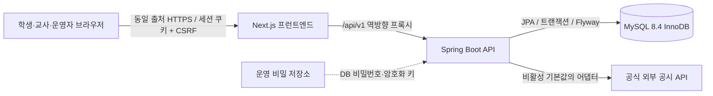

# 시스템 아키텍처

## 목표

학교 소통 제안 시스템은 한 저장소 안의 독립된 Next.js 프런트엔드와 Spring Boot 백엔드로 구성한다. 모든 권한·상태 전이·익명성 규칙은 백엔드와 MySQL에서 강제하며, 프런트엔드는 정책의 보안 경계가 아니다.

로컬에서도 브라우저는 Next.js의 `/api` 경로를 사용한다. 이 경로를 백엔드로 프록시해 CORS와 교차 출처 쿠키 의존성을 피한다. 운영에서는 TLS 종료 프록시가 같은 출처로 두 애플리케이션을 제공하는 구성을 전제로 하며, 실제 배포 구성은 별도 승인 전까지 저장소에 넣지 않는다.

## 백엔드 모듈 경계

- `common`: 보안 구성, traceId, 공통 오류, OpenAPI 같은 횡단 관심사
- `auth`, `user`, `office`: 자체 인증, 계정 생명주기, 역할과 임기 기반 보직
- `proposal`, `support`: 공개 제안, 동의, 원자적 정식 안건 승격
- `moderation`, `identity`: 공개 제한 심의와 독립된 신원 확인 심의/열람
- `privatecase`: 비공개 고충·안전 제보
- `disclosure`, `finance`: 학교 재정·행정 공개와 외부 공시 어댑터
- `audit`: 추가만 가능한 보안·업무 감사 사건

Controller는 DTO 검증과 HTTP 변환만, Service는 정책·권한·트랜잭션을, Repository는 영속화를 담당한다. Entity를 외부 응답으로 반환하지 않는다.

## 데이터와 시간

- 내부 관계 키는 무작위 UUID이며 로그인 ID나 학번과 분리한다.
- 외부 URL에는 별도의 예측 불가능한 공개 식별자를 사용한다.
- DB 시간은 UTC로 저장하고 사용자 표시는 `Asia/Seoul`로 변환한다.
- 익명 작성자 연결정보는 일반 제안 테이블과 분리하고 인증된 암호화로 보호한다.
- 세션과 보안 차단 상태는 MySQL에 저장한다. Redis는 사용하지 않는다.
- 감사 로그는 애플리케이션의 일반 수정/삭제 기능을 제공하지 않는다.

## 핵심 일관성 경계

1. 제안 생성과 작성자 자동 동의는 한 트랜잭션이다.
2. 동의 고유 제약, 유효 동의 수 확인, 50명 승격, 상태 이력, 알림 생성은 동시성 안전한 한 트랜잭션이다.
3. 심의 사건은 생성 시 보직자를 스냅샷하고 이후 보직 변경과 독립적이다.
4. 신원 복호화는 3인 전원 승인, 학생부장교사 보직, 최근 재인증을 모두 다시 확인한 뒤 별도 서비스에서 수행한다.

## 환경 분리

- `dev`: Swagger UI와 명시적인 개발 편의 기능을 허용한다.
- `test`: 실제 MySQL 호환 Testcontainers를 사용한다.
- `prod`: Swagger 비활성화, Secure 쿠키, HTTPS 전제, 자동 스키마 초기화 금지.

외부 공시 연동, 운영 백업, TLS, 비밀관리 제품은 현재 미확정이다. 어댑터와 설정 경계만 만들고 안전하게 비활성화한다.
