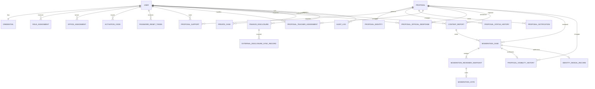

# 논리 ERD와 주요 제약

이 ERD는 전체 제품 경계를 고정하기 위한 논리 모델이다. Flyway 구현은 기능 단계별로 작은 마이그레이션으로 나눈다. 아직 확정되지 않은 보존 기간과 담당자 정책은 컬럼 기본값으로 하드코딩하지 않는다.

## 식별자

- `users.id`: BINARY(16) 내부 무작위 UUID. 로그인 ID/학번과 별개다.
- 외부 노출 리소스는 `public_id` UUID를 별도로 가진다.
- 내부 UUID, 학번, 로그인 ID는 일반 응답과 URL에 함께 노출하지 않는다.
- 모든 시각은 UTC 정밀도로 저장한다.

## 핵심 테이블 책임

| 테이블 | 책임 | 필수 제약 |
| --- | --- | --- |
| `users` | 계정 상태와 공개 가능한 기본 프로필 | `login_id` 고유, 상태 allowlist |
| `credentials` | Argon2id 해시와 자격 증명 버전 | 사용자 1:1, 해시만 저장 |
| `role_assignments` | 역할의 기간 이력 | 유효 기간, 임명자 감사 |
| `office_assignments` | 보직의 기간 이력 | 보직별 시간 중복 방지는 서비스+잠금으로 검증 |
| `activation_codes` | 가입 코드 해시·만료·사용 | 원문 없음, 일회 사용 |
| `password_reset_tokens` | 재설정 코드 해시·만료·사용 | 원문 없음, 일회 사용 |
| `bootstrap_markers` | 최초 슈퍼 어드민 단일 실행 마커 | 이름 PK, 완료 사용자와 시각 기록 |
| `proposals` | 공개 내용, 공개 방식, 업무/공개 상태 | 작성자 내부 ID 없음 |
| `proposal_identities` | 제안-작성자 보호 연결 | 제안 1:1, AEAD 암호문·nonce·키 버전 |
| `proposal_supports` | 비공개 동의자 관계 | `UNIQUE(proposal_id, voter_user_id)` |
| `proposal_status_history` | append-only 업무 상태 변경 | 일반 update/delete 경로 없음 |
| `proposal_notifications` | 정식 안건 교사 알림 아웃박스 | 제안+알림 유형 고유, 승격 트랜잭션에 포함 |
| `proposal_teacher_assignments` | 내부 담당 교사 지정·변경 이력 | 생성 열 고유 제약으로 제안별 현재 담당 최대 1명, 이전 행 보존 |
| `proposal_official_responses` | 공개 공식 답변과 실행 업데이트 | 허용 결과 상태, 내부 응답자 FK, 일반 DTO에서 응답자 제외 |
| `content_reports` | 사용자의 제안 신고와 사유 | 제안+신고자 고유. 임계값 도달 시 `visibility_status`를 `RESTRICTED`로 바꾸며 원문은 그대로 둔다 |
| `moderation_cases` | 공개 제한 또는 신원 확인 사건 | 사건 유형 allowlist, 대상과 사유 필수 |
| `moderation_reviewer_snapshots` | 사건 당시 3인 심의자 | 사건+보직 고유, 정확히 3명은 생성 서비스에서 검증 |
| `moderation_votes` | 심의자 1회 승인/거부 | 심의자 스냅샷당 최대 1표 |
| `proposal_visibility_history` | 심의에 따른 공개 상태 변경 | 사건당 최대 1행, 원문 삭제 없이 전후 상태 보존 |
| `identity_reveal_records` | 실제 신원 열람 감사 | 승인 사건, 학생부장교사, 재인증을 서비스에서 검증 |
| `private_cases` | 별도 비공개 고충 데이터 | 공개 제안과 FK 공유 금지 |
| `finance_disclosures` | 예산/실제 집행 공개 | 금액 종류 allowlist, 검증 상태 |
| `audit_logs` | 보안·업무 사건 추가 기록 | 민감 원문 금지, 앱의 update/delete 금지 |

## 동시성 불변조건

`proposal_supports`의 고유 제약이 중복 동의의 최종 통제다. 동의 생성 트랜잭션은 대상 제안을 잠그고, 고유 제약 충돌을 같은 성공 결과로 정규화하며, DB의 유효 동의 건수를 다시 계산한다. 50명 이상이고 아직 모집 중일 때만 조건부 상태 갱신으로 한 번 승격하고 상태 이력과 알림을 함께 기록한다.

담당 지정은 제안 행을 잠그고 현재 지정 행을 종료한 뒤 새 지정 행을 추가한다. 생성된 `current_proposal_id`의 고유 제약이 제안별 현재 담당 1명을 최종 통제한다. 상태 전이는 같은 제안 행 잠금 아래 현재 담당·활성 교사 역할과 예상 이전 상태를 재검증하고, 상태 이력·공식 답변·감사 로그를 한 트랜잭션으로 기록한다.

심의 사건 생성은 세 보직의 사건 시점 유효 임명을 잠근 뒤 세 스냅샷을 같은 트랜잭션으로 만든다. 보직 공석이나 중복 임명이 있으면 사건 생성을 실패시켜 불완전한 심의 체계를 만들지 않는다.

의결은 사건 행을 먼저 잠그고 심의자 스냅샷당 고유 제약으로 1표만 허용한다. 반대가 있으면 반려하고 세 승인표가 모두 저장된 경우에만 승인한다. 공개 제한 사건 승인 시 공개 상태와 이력을 같은 트랜잭션으로 기록한다. 신원 확인은 승인 사건 행을 잠근 뒤 전용 열람 행의 사건 고유 제약으로 한 번만 수행한다.
