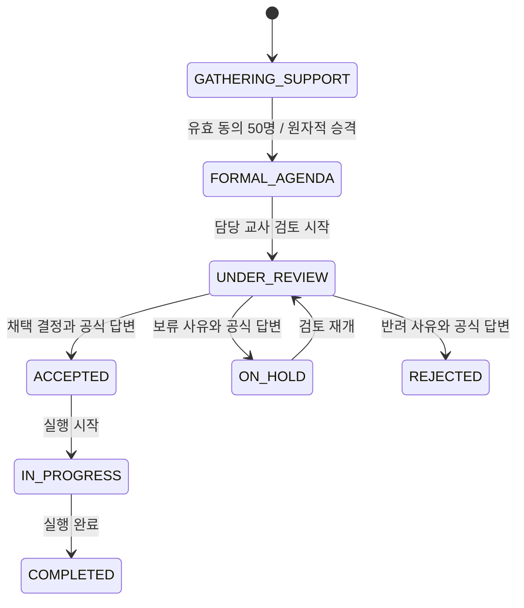
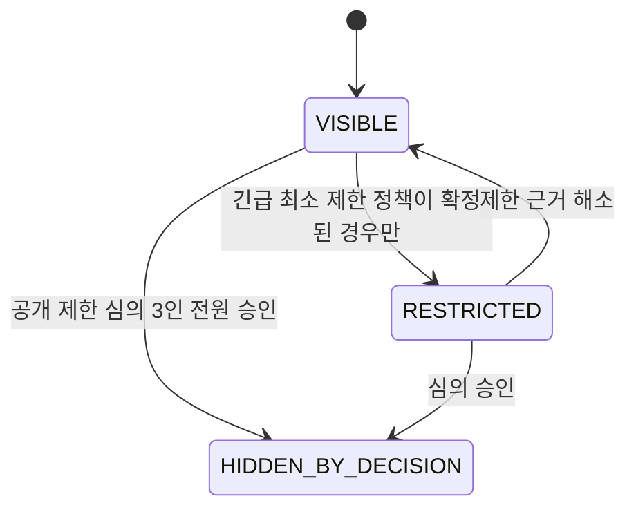
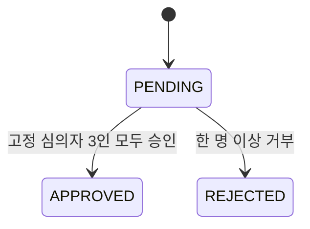

# 상태 전이

업무 처리 상태와 공개 상태는 독립적으로 관리한다. 공개 제한 심의가 업무 진행 이력을 지우거나, 업무 상태 변경이 심의 결정을 우회해서는 안 된다.

## 제안 업무 상태

- 50명 승격 후 `GATHERING_SUPPORT`로 되돌리지 않는다.
- 임의 상태 문자열을 받지 않고 상태별 명령을 명시한다.
- 모든 전이는 변경자, 전후 상태, 서버 시각, 이유를 append-only 이력으로 남긴다.
- 정확한 답변 기한과 동의 모집 만료는 현재 전이에 넣지 않는다.
- `FORMAL_AGENDA` 이후 상태 명령은 슈퍼 어드민이 내부 지정한 현재 담당 교사만 실행한다.
- 담당 변경은 기존 지정 행을 종료하고 새 행을 추가하며, 학생용 API에는 담당·응답 교사 식별자를 싣지 않는다.
- `ACCEPTED`, `ON_HOLD`, `REJECTED`, `IN_PROGRESS`, `COMPLETED` 전이는 공개 공식 답변을 같은 트랜잭션에 추가한다.

## 공개 상태

`HIDDEN_BY_DECISION`은 물리 삭제가 아니다. 원문, 신고, 심의 표와 결정 이력을 보존한다. 이의 제기와 재심 절차가 미정이므로 복구 전이는 아직 확정하지 않는다.

## 공개 제한 및 신원 확인 사건

- `CONTENT_VISIBILITY`와 `IDENTITY_REVEAL`은 서로 다른 사건으로 생성한다.
- 심의 표는 덮어쓰지 않는다. 심의자당 사건별 한 번만 행사한다.
- `IDENTITY_REVEAL=APPROVED`는 신원을 응답 DTO에 싣는 상태가 아니다. 고정 심의자의 별도 재인증 열람 명령을 승인 시점부터 정해진 기간 동안 가능하게 하는 선행조건이다.
- 실제 신원 열람은 사건별 최대 한 번이며 열람 완료 뒤 결과를 일반 사건 조회로 다시 제공하지 않는다.
